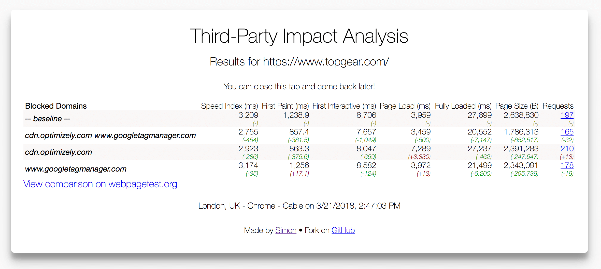

# third-party-impact

Runs multiple webpagetest performance tests to determine the impact of third-party domains on site speed.

## install

1. clone this repo
2. copy `.env.sample` to `.env` and populate the variables `WPT_SERVER` `WPT_APIKEY` and `PORT`
3. `npm install`
4. `npm run dev`